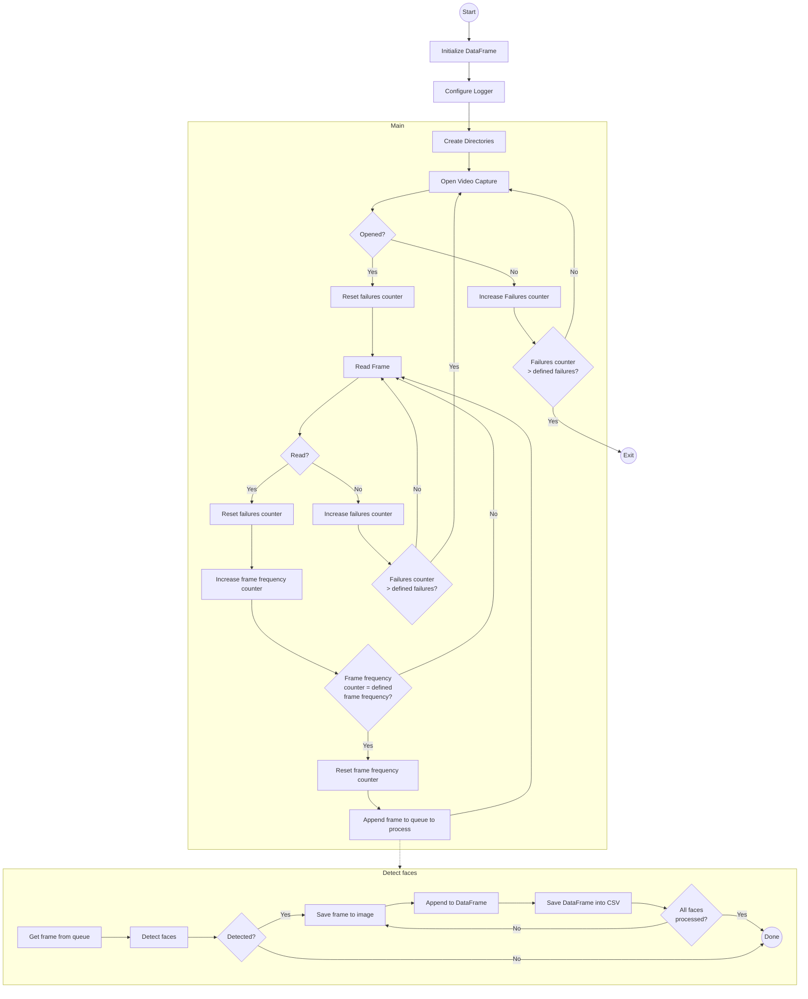

```mermaid
graph TD
    A((Start)) --> B[Initialize DataFrame]
    B --> C[Configure Logger]
    C --> D[Create Directories]
    subgraph Main
        D --> E[Open Video Capture]
        E --> F{Opened?}
        F --> |Yes| AA[Reset failures counter]
        AA --> G[Read Frame]
        G --> H{Read?}
        H --> |Yes| T[Reset failures counter]
        T --> U[Increase frame frequency counter]
        U --> V{Frame frequency <br> counter = defined <br> frame frequency?}
        V --> |Yes| W[Reset frame frequency counter]
        V --> |No| G 
        H --> |No| R[Increase failures counter]
        R --> S{Failures counter <br> > defined failures?}
        S --> |No| G
        S --> |Yes| E
        F --> |No| X[Increase Failures counter]
        X --> Y{Failures counter <br> > defined failures?}
        Y --> |No| E
        W --> AC[Append frame to queue to process]
        AC --> G
    end
    AC -.-> SA
    subgraph SA[Detect faces]
        AD[Get frame from queue] --> AE[Detect faces]
        AE --> J{Detected?}
        J -->|Yes| L[Save frame to image]
        L --> P[Append to DataFrame]
        P --> Q[Save DataFrame into CSV]
        Q --> AF{All faces <br> processed?}
        AF --> |No| L
        AF --> |Yes| AG((Done))
        J --> |No| AG
    end
    Y --> |Yes| Z((Exit))

classDef empty width:0px,height:0px;
```